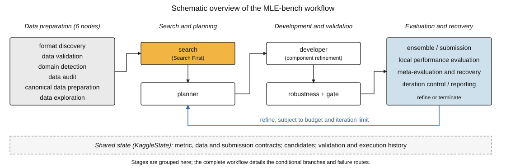
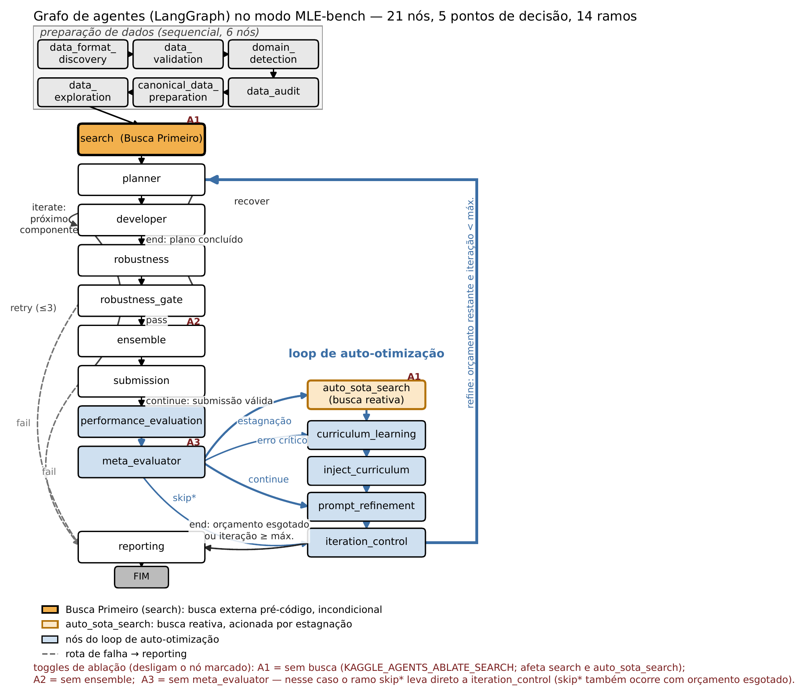
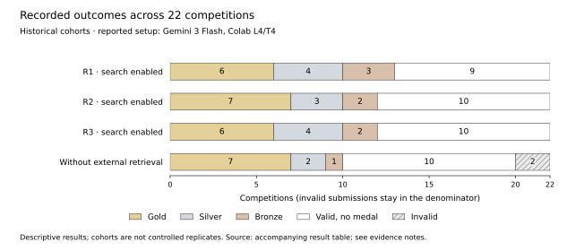
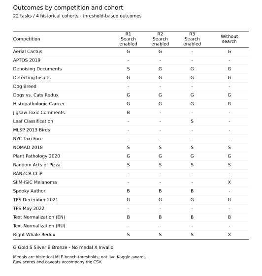

# Kaggle Agents

**Autonomous machine learning engineering, explored on a single GPU.**

Kaggle Agents turns a competition specification and dataset into a modeling workflow: inspect the data, retrieve references, plan experiments, generate and refine code, validate candidates, and produce a submission. In MLE-bench mode, a **21-node LangGraph workflow** coordinates these stages through shared data, metric, and submission contracts; regular Kaggle mode adds a download node.

The reported research setting uses **Gemini 3 Flash and one Colab L4/T4 GPU per run**, across the 22 tasks of MLE-bench Lite. Its central design combines **Search First**, **targeted refinement**, **robustness checks**, and **recovery driven by execution evidence**.



<p align="center">
  <a href="#results">Results</a> ·
  <a href="#architecture">Architecture</a> ·
  <a href="#quickstart">Quickstart</a> ·
  <a href="docs/research/evidence.md">Evidence &amp; reproducibility</a>
</p>

| Research setting | Workflow | Recorded later cohorts | Retrieval-disabled cohort |
| :--- | :--- | :--- | :--- |
| 22 tasks · image, text, audio, tabular | 21 nodes · 5 decision points | Reported R2 and R3: **22/22 valid**, **12/22 medals** each | **20/22 valid**, **10/22 medals** |

> **Evidence status.** These are historical, exploratory outcomes. The available records do not establish controlled replications or a causal benefit from any one component. R1 is also search enabled; its records include target-competition retrieval and test-feedback evidence. The [evidence notes](docs/research/evidence.md) document the stored notebook outputs and known limitations.

## What this project contributes

- **An inspectable workflow.** Specialized stages share a typed `KaggleState` instead of independently redefining the task, metric, validation split, or submission format.
- **Retrieval before implementation.** Search First supplies references before planning; a separate reactive search route can respond to stagnation later in the run.
- **Validation inside the loop.** Candidate promotion uses local validation evidence, canonical artifacts, and explicit robustness decisions, with recovery or failure paths when a candidate cannot be accepted.
- **A documented experimental record.** Four cohorts cover 22 tasks each. Per-competition scores, medal outcomes, invalid submissions, and known protocol differences are available below.

The architecture draws on [MLE-STAR's search and targeted refinement](https://arxiv.org/abs/2506.15692), with its own orchestration, contracts, and recovery mechanisms. This repository is an independent implementation.

## Architecture

The overview above groups the workflow into four conceptual stages. The full graph below details the **21-node MLE-bench workflow**, with its development loop and conditional recovery routes.

[](docs/assets/pipeline-paper.pdf)

*Original Portuguese figure: [vector PDF](docs/assets/pipeline-paper.pdf). Topology: [MLE-bench graph](kaggle_agents/workflow/graphs/mlebench.py). The current graph has 21 nodes, 16 unconditional edges, and 5 conditional routing points with 14 labeled branches. Ablation flags change node behavior; the nodes remain in the graph.*

| Stage | Responsibilities | Code entry points |
| :--- | :--- | :--- |
| **Prepare the task** | Discover formats, validate files, detect the domain, audit inputs, prepare canonical data, and explore the dataset | [Workflow nodes](kaggle_agents/workflow/nodes) |
| **Retrieve and plan** | Gather permitted references; turn the task and evidence into a component plan | [Search agent](kaggle_agents/agents/search_agent.py), [planner](kaggle_agents/agents/planner) |
| **Develop and validate** | Generate code, iterate over components, evaluate local predictions, and run robustness checks | [Developer](kaggle_agents/agents/developer), [robustness agent](kaggle_agents/agents/robustness_agent.py) |
| **Assemble a submission** | Ensemble eligible candidates, construct the CSV, and retry or stop when the artifact is invalid | [Ensemble](kaggle_agents/agents/ensemble), [submission agent](kaggle_agents/agents/submission_agent.py) |
| **Recover and finish** | Inspect execution history, trigger reactive search or curriculum guidance, refine prompts, and replan or report | [Meta-evaluator](kaggle_agents/agents/meta_evaluator_agent.py), [routing](kaggle_agents/workflow/routing.py) |

### Shared contracts and the evaluation boundary

[`KaggleState`](kaggle_agents/core/state) carries the metric definition, canonical data references, submission schema, plans, candidate artifacts, and execution history. These contracts give the agents a common definition of a valid solution.

In the **current MLE-bench implementation**, the optimization loop uses local validation; final benchmark grading is handled by the [runner](kaggle_agents/mlebench/runner.py). The graph's `performance_evaluation` node is a local evaluation stage, not permission to optimize against the held-out benchmark score.

| Control | Current implementation | Scope of the claim |
| :--- | :--- | :--- |
| Retrieval policy | Queries and source checks filter target-competition material in MLE-bench mode; decisions are recorded in `search_audit` | A software guard, not proof that historical runs were uncontaminated |
| Candidate validation | Recomputes trusted out-of-fold (OOF) scores from canonical artifacts before promotion | Candidates without verifiable OOF can remain explicitly unscored |
| Robustness gate | Explicit pass, bounded recovery, or fail-closed termination | Invalid candidates can end a run without a submission |
| Submission integrity | Final artifact snapshots and SHA-256 checks | Makes the evaluated file identifiable |
| Time budget | Cooperative checks between stages, plus component timeouts | Requires external enforcement for a strict experiment deadline |

These boundaries apply to the current code. Historical results below are not a fresh evaluation of this checkout.

## Results

**22 competitions in every cohort.** Each row below contains one reported outcome per task. A medal means that the score crossed an MLE-bench historical medal threshold; it does not mean a live Kaggle medal was awarded.



| Cohort | Valid submissions | Any medal | Gold / Silver / Bronze | Recorded mean time per task |
| :--- | ---: | ---: | :---: | ---: |
| **R1 · search enabled** | 22/22 (100%) | 13/22 (59.1%) | 6 / 4 / 3 | 6.92 h |
| **R2 · search enabled** | 22/22 (100%) | 12/22 (54.5%) | 7 / 3 / 2 | 5.13 h |
| **R3 · search enabled** | 22/22 (100%) | 12/22 (54.5%) | 6 / 4 / 2 | 5.19 h |
| **Without external retrieval** | 20/22 (90.9%) | 10/22 (45.5%) | 7 / 2 / 1 | 4.68 h |

*Sources: [per-competition results](docs/research/results.md) and [preserved aggregate table](docs/research/sources/tab3_agregados.tex), with partial corroboration from stored notebook outputs. Invalid submissions remain in the denominator of 22. Times are descriptive: iteration limits and execution conditions differ. See [provenance and limitations](docs/research/evidence.md).*

**What the record supports.** The result tables report that the later search-enabled cohorts each completed all 22 tasks with valid submissions and reached 12 medal thresholds. This is evidence of end-to-end operation across a varied task set. It does not isolate which architectural component produced those outcomes.

**What changes without retrieval.** The recorded cohort has 10 medals and two invalid submissions: **Right Whale Redux** and **SIIM-ISIC Melanoma**. The stored Whale log records a robustness block. A supplied SIIM-ISIC notebook also shows a missing submission, but its exact association with the reported run is unproven. The switch removes Search First, reactive search, and external loading examples together. It is an exploratory comparison of that retrieval bundle.

<details>
<summary><strong>Explore all 22 competitions: medal map and numerical results</strong></summary>



Read the [complete score table](docs/research/results.md) or download the [88-row CSV](docs/research/results_by_competition.csv). Scores are on each task's native metric and should only be compared within that task. Rounded scores can hide a medal-threshold crossing; use the recorded medal label.

</details>

### How to interpret the comparisons

R1 contains historical evidence of target-competition retrieval and test-score feedback during optimization. In the later stored summaries, **seed 42** is recorded; those files do not establish a three-seed evaluation. Effective iteration ceilings also vary, and there is no complete immutable manifest tying every outcome to a single commit, prompt set, corpus, grader, and hardware allocation.

For that reason, this README reports **per-cohort counts and rates**, without a pooled confidence interval, a causal Search First effect, or a ranking against differently configured systems. The [evidence notes](docs/research/evidence.md#reconciling-results-and-execution-records) explain the limits of the available execution record.

## Notebooks

| Purpose | Versioned source | Open in Colab |
| :--- | :--- | :--- |
| MLE-bench Lite evaluation | [Evaluation notebook](notebooks/kaggle_agents_mlebench_lite_colab.ipynb) | [Launch from GitHub](https://colab.research.google.com/github/gustavogomespl/kaggle-agents/blob/main/notebooks/kaggle_agents_mlebench_lite_colab.ipynb) |
| Regular Kaggle competition | [Competition notebook](kaggle_agents_competition_colab.ipynb) | [Launch from GitHub](https://colab.research.google.com/github/gustavogomespl/kaggle-agents/blob/main/kaggle_agents_competition_colab.ipynb) |
| MLE-STAR baseline setup | [Baseline notebook](notebooks/mlestar_baseline_mlebench_lite_colab.ipynb) | [Launch from GitHub](https://colab.research.google.com/github/gustavogomespl/kaggle-agents/blob/main/notebooks/mlestar_baseline_mlebench_lite_colab.ipynb) |

The baseline notebook provides an entry point for a future comparison with aligned settings; its presence does not establish a completed matched experiment. Configure credentials in Colab secrets or your environment, and review the run settings before starting a GPU session.

<details>
<summary>Original shared Colab examples</summary>

- [MLE-bench evaluation session](https://colab.research.google.com/drive/1AluH6I7vniCIo-ULCBRJJlco7K7tdFk_?usp=sharing#scrollTo=081AGrB8PYJD)
- [Kaggle competition session](https://colab.research.google.com/drive/14INytAtGtAQ5935yEj27cJi4zwsFTbkJ#scrollTo=run_workflow)

These shared sessions may differ from the versioned notebooks above.

</details>

## Quickstart

### 1. Install the project

Use **Python 3.10–3.13** and [uv](https://docs.astral.sh/uv/). The dependency set includes ML libraries; GPU experiments need a compatible GPU environment. Colab is the environment used in the recorded runs.

```bash
git clone https://github.com/gustavogomespl/kaggle-agents.git
cd kaggle-agents
uv sync --frozen
```

### 2. Configure a provider and Kaggle access

The following selects the recorded Gemini 3 Flash API identifier; check that your account can access it before starting an evaluation. A different model creates a different experimental configuration.

```bash
export LLM_PROVIDER=gemini
export LLM_MODEL=gemini-3-flash-preview
export GOOGLE_API_KEY="your-provider-key"
export KAGGLE_USERNAME="your-kaggle-username"
export KAGGLE_KEY="your-kaggle-api-key"
export KAGGLE_AUTO_SUBMIT=false
```

See [`.env.example`](.env.example) and [configuration](kaggle_agents/core/config.py) for provider settings and per-role overrides. Accept a competition's rules on Kaggle before downloading its data. Model calls and GPU sessions consume their respective service budgets.

### 3. Run a regular Kaggle task locally

```bash
uv run kaggle-agents start titanic --max-iterations 2
```

The local CLI downloads the competition data, runs the workflow, and attempts to build a submission under `competitions/titanic/`. Automatic submission is disabled in the configuration above. To explicitly enable live Kaggle submission, set `KAGGLE_AUTO_SUBMIT=true` before running.

The separate [`notebooks/kaggle_eval.py`](notebooks/kaggle_eval.py) script is oriented toward Colab and defaults to `/content/kaggle_competitions`; use the local CLI for the command above.

### 4. Evaluate with MLE-bench

**MLE-bench is installed separately.** Follow the [official setup and data preparation instructions](https://github.com/openai/mle-bench#setup), including Git LFS and Kaggle access. Install its package into the same Python environment that runs Kaggle Agents, then prepare the selected task. The [Colab evaluation notebook](notebooks/kaggle_agents_mlebench_lite_colab.ipynb) includes this setup.

For an already configured **Colab/Linux evaluation environment**:

```bash
# First evaluate one prepared task.
uv run --no-sync python notebooks/mlebench_eval.py \
  -c aerial-cactus-identification \
  --seed 42 --max-iterations 5 --wall-clock-budget 25200

# Full sweep: 22 prepared tasks.
uv run --no-sync python notebooks/mlebench_eval.py \
  --lite --seed 42 --max-iterations 5 --wall-clock-budget 25200
```

The sweep CLI uses `/content/kaggle_competitions` for workspaces and the runner's default cache location. `--wall-clock-budget` is a cooperative budget, not a guaranteed process-kill deadline. These commands define a new run; they do not reproduce the heterogeneous historical settings exactly.

<details>
<summary><strong>Use explicit data and workspace paths on a local machine</strong></summary>

Once MLE-bench is installed and the competition is prepared, use the Python entry point. Set `mle_cache_path` to the actual MLE-bench **data directory**, which contains the competition directories.

```python
import os
from pathlib import Path

os.environ["RUN_SEED"] = "42"  # set before importing the configuration

from kaggle_agents.mlebench import solve_mlebench

result = solve_mlebench(
    competition_id="aerial-cactus-identification",
    mle_cache_path=str(Path("/absolute/path/to/mle-bench/data")),
    workspace_base=str(Path("./mlebench_workspaces").resolve()),
    max_iterations=5,
    wall_clock_budget_s=7 * 3600,
)
print(result)
```

`solve_mlebench()` returns an individual result. The aggregate files below are written by the sweep script.

</details>

### Outputs to inspect

| Artifact | Purpose |
| :--- | :--- |
| `mlebench_results/results.json` | Per-attempt results with experiment identity and status |
| `mlebench_results/summary.json` and `results.csv` | Sweep summaries and tabular analysis |
| Workspace `telemetry.json` | Run provenance, interventions, recovery decisions, and search audit |
| Submission CSV and verified snapshot | The prediction artifact used for final grading |
| Workspace reports and execution logs | Diagnose validation, generated-code, and finalization behavior |

The [runner](kaggle_agents/mlebench/runner.py) and [evaluation CLI](notebooks/mlebench_eval.py) define these artifacts. Inspect `terminal_status` and `failure_origin` when aggregating: provider, harness, or environment errors are distinct from an agent's completed unsuccessful attempt.

## Ablations and configuration

Set flags to the literal string `true` **before configuration is initialized**. In a notebook that already imported the project, call `reset_config()` after changing environment variables.

| Environment variable | Effect when `true` | Evidence in this documentation |
| :--- | :--- | :--- |
| `KAGGLE_AGENTS_ABLATE_SEARCH` | Replace Search First and reactive retrieval with fallbacks; disable external data-loading examples | One historical `without-search` cohort |
| `KAGGLE_AGENTS_ABLATE_ROBUSTNESS` | Bypass robustness modules; benchmark artifact identity and OOF requirements remain | Implemented toggle; no component-specific result claimed |
| `KAGGLE_AGENTS_ABLATE_META_EVALUATOR` | Bypass meta-evaluation, recovery, and prompt-refinement routes | Implemented toggle; no component-specific result claimed |
| `KAGGLE_AGENTS_ABLATE_ENSEMBLE` | Keep a single-model submission instead of ensembling | Implemented toggle; no component-specific result claimed |

```bash
export KAGGLE_AGENTS_ABLATE_SEARCH=true
```

```python
from kaggle_agents.core.config import reset_config

reset_config()  # needed only if configuration was already loaded
```

Check the stored arm (`full` or `without-search`) and configuration fingerprint in the run output. `KAGGLE_AGENTS_ALLOW_SAME_COMP_SOURCES` is a legacy compatibility setting: **the current MLE-bench mode always enforces its target-competition source filter**. Regular Kaggle mode has different retrieval rules.

## Reproducibility and research use

To build a controlled follow-up experiment, freeze the code revision, prompts, model/provider, retrieval corpus, dataset/grader versions, hardware, and budget. Run the full and retrieval-disabled arms under matched conditions for several seeds, retain unsuccessful outcomes, and save the final artifact hashes and structured failure status. The [MLE-bench protocol](https://github.com/openai/mle-bench#benchmarking) recommends at least three seeds and reporting Any Medal as mean ± one standard error across evaluations.

The [research evidence guide](docs/research/evidence.md) documents the source hierarchy, notebook caveats, and numerical transcription. The result figures can be regenerated without running models:

```bash
python docs/assets/render_results.py  # requires matplotlib
```

### Repository map

```text
kaggle_agents/
├── agents/              # search, planning, development, robustness, ensemble
├── core/                # configuration, shared state and contracts
├── workflow/            # graphs, nodes and routing
├── mlebench/            # benchmark adapter, runner and final grading
├── tools/               # retrieval, code execution and validation tools
└── utils/               # budgets, artifacts and supporting utilities
notebooks/               # evaluation scripts and Colab workflows
tests/                   # unit and protocol checks
docs/
├── research/            # evidence notes, full score table and CSV
└── assets/              # workflow diagram, overview and result figures
```

## Development

```bash
uv sync --frozen --extra dev
uv run ruff check kaggle_agents tests
uv run pytest tests -q
```

See [test documentation](tests/README.md). Useful protocol checks include [benchmark feedback boundaries](tests/test_mlebench_protocol.py) and [prompt contamination policy](tests/test_prompt_contamination_policy.py).

Generated programs run with credentials removed from their environment and a temporary home directory. This is defense in depth; use a disposable container or VM with restricted mounts and network access when executing untrusted generated programs. See the [execution tools](kaggle_agents/tools/code_executor).

## Related work and citation

- [MLE-bench](https://github.com/openai/mle-bench): benchmark tasks, grading, and evaluation protocol.
- [MLE-STAR](https://arxiv.org/abs/2506.15692): external retrieval and targeted refinement, central inspirations for this project.

To cite the software, use the repository and include the exact revision used in your experiment:

```bibtex
@misc{gomes_kaggle_agents,
  author       = {Gustavo Paulino Gomes},
  title        = {Kaggle Agents},
  howpublished = {Software repository},
  url          = {https://github.com/gustavogomespl/kaggle-agents}
}
```

## License

MIT, as declared by the project. A standalone license file is not currently included in this checkout.
